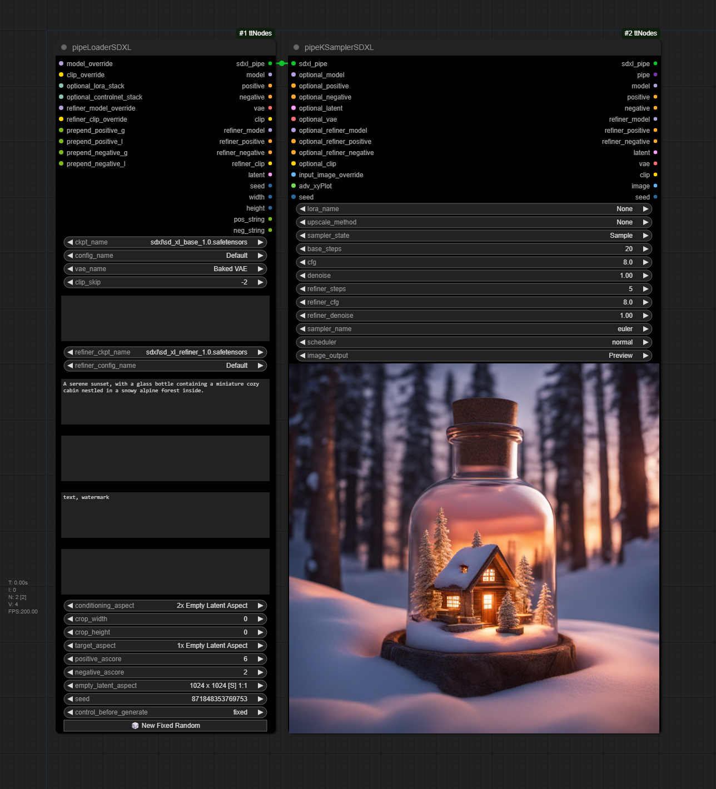
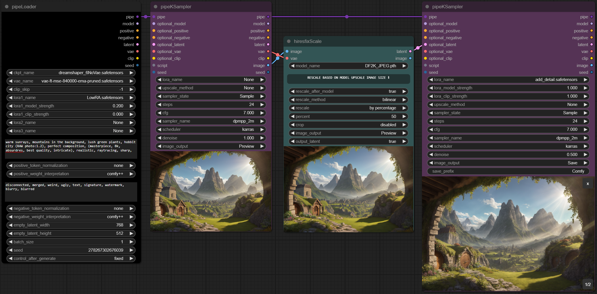
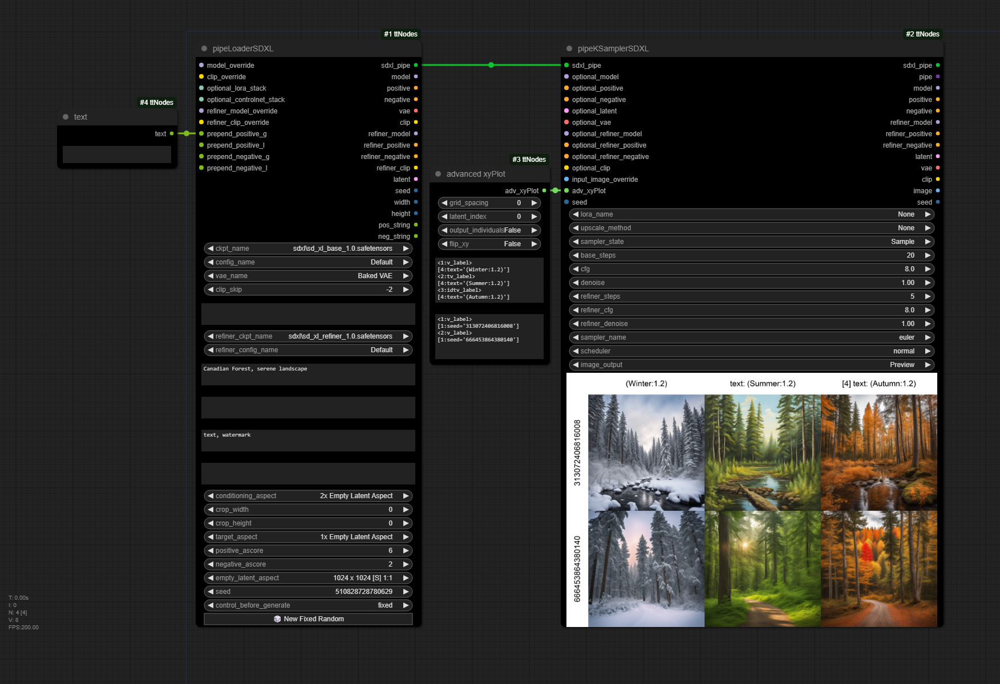
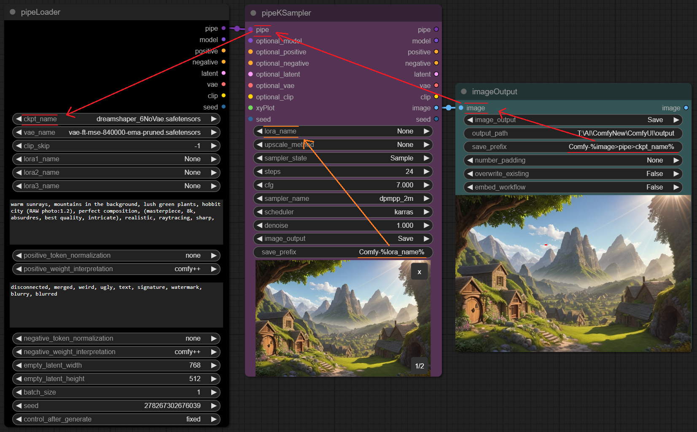

# tinyterraNodes
A selection of custom nodes for [ComfyUI](https://github.com/comfyanonymous/ComfyUI).

 
 

## Installation
Navigate to the **_ComfyUI/custom_nodes_** directory with cmd, and run:

`git clone https://github.com/TinyTerra/ComfyUI_tinyterraNodes.git`

### Special Features
**Embedding Auto Complete**

*Enabled by default*
+ displays a popup to autocomplete embedding filenames in text widgets - to use, start typing **embedding** and select an option from the list
+ Option to disable ([ttNodes] enable_embed_autocomplete = True | False)

**Dynamic Widgets**

*Enabled by default*

+ Automatically hides and shows widgets depending on their relevancy
+ Option to disable ([ttNodes] enable_dynamic_widgets = True | False)

**ttNinterface**

*Enabled by default*

+ 

Adds 'Node Dimensions (ttN)' to the node right-click context menu
 Allows setting specific node Width and Height values as long as they are above the minimum size for the given node.
+ 

Adds 'Default BG Color (ttN)' to the node right-click context menu
 Allows setting specific default background color for every node added.
+ 

Adds 'Show Execution Order (ttN)' to the node right-click context menu
 Toggles execution order flags on node corners.
+ 

Adds support for 'ctrl + arrow key' Node movement
 This aligns the node(s) to the set ComfyUI grid spacing size and move the node in the direction of the arrow key by the grid spacing value. Holding shift in addition will move the node by the grid spacing size * 10.
+ 

Adds 'Reload Node (ttN)' to the node right-click context menu
 Creates a new instance of the node with the same position, size, color and title (will disconnect any IO wires). It attempts to retain set widget values which is useful for replacing nodes when a node/widget update occurs 

+ 

Adds 'Slot Type Color (ttN)' to the Link right-click context menu
 Opens a color picker dialog menu to update the color of the selected link type. 

+ 

Adds 'Link Border (ttN)' to the Link right-click context menu
 Toggles link line border. 

+ 

Adds 'Link Shadow (ttN)' to the Link right-click context menu
 Toggles link line shadow. 

+ 

Adds 'Link Style (ttN)' to the Link right-click context menu
 Sets the default link line type. 

**Save image prefix parsing**

+ Add date/time info to filenames or output folder by using: %date:yyyy-MM-dd-hh-mm-ss%
+ Parse any upstream setting into filenames or output folder by using %[widget_name]% (for the current node)  
or %[input_name]>[input_name]>[widget_name]% (for inputting nodes)  
  

Example:
  

  
  

**Node Versioning**

+ All tinyterraNodes now have a version property so that if any future changes are made to widgets that would break workflows the nodes will be highlighted on load
+ Will only work with workflows created/saved after the v1.0.0 release

**AutoUpdate**

*Disabled by default*

+ Option to auto-update the node pack ([ttNodes] auto_update = False | True)

 

	
$\Large\color{white}{Nodes}$

## ttN/pipe

  
pipeLoader

  
(Modified from [Efficiency Nodes](https://github.com/LucianoCirino/efficiency-nodes-comfyui) and [ADV_CLIP_emb](https://github.com/BlenderNeko/ComfyUI_ADV_CLIP_emb))

Combination of Efficiency Loader and Advanced CLIP Text Encode with an additional pipe output
+ _**Inputs -** model, vae, clip skip, (lora1, modelstrength clipstrength), (Lora2, modelstrength clipstrength), (Lora3, modelstrength clipstrength), (positive prompt, token normalization, weight interpretation), (negative prompt, token normalization, weight interpretation), (latent width, height), batch size, seed_
+ _**Outputs -** pipe, model, conditioning, conditioning, samples, vae, clip, seed_
   

  
pipeKSampler

  
(Modified from [Efficiency Nodes](https://github.com/LucianoCirino/efficiency-nodes-comfyui) and [QOLS_Omar92](https://github.com/omar92/ComfyUI-QualityOfLifeSuit_Omar92))

Combination of Efficiency Loader and Advanced CLIP Text Encode with an additional pipe output
+ _**Inputs -** pipe, (optional pipe overrides), xyplot, (Lora, model strength, clip strength), (upscale method, factor, crop), sampler state, steps, cfg, sampler name, scheduler, denoise, (image output [None, Preview, Save]), Save_Prefix, seed_
+ _**Outputs -** pipe, model, conditioning, conditioning, samples, vae, clip, image, seed_

Old node layout:

With pipeLoader and pipeKSampler:

  

  
pipeKSamplerAdvanced

Combination of Efficiency Loader and Advanced CLIP Text Encode with an additional pipe output
+ _**Inputs -** pipe, (optional pipe overrides), xyplot, (Lora, model strength, clip strength), (upscale method, factor, crop), sampler state, steps, cfg, sampler name, scheduler, starts_at_step, return_with_leftover_noise, (image output [None, Preview, Save]), Save_Prefix_
+ _**Outputs -** pipe, model, conditioning, conditioning, samples, vae, clip, image, seed_

  

  

  
pipeLoaderSDXL

SDXL Loader and Advanced CLIP Text Encode with an additional pipe output
+ _**Inputs -** model, vae, clip skip, (lora1, modelstrength clipstrength), (Lora2, modelstrength clipstrength), model, vae, clip skip, (lora1, modelstrength clipstrength), (Lora2, modelstrength clipstrength), (positive prompt, token normalization, weight interpretation), (negative prompt, token normalization, weight interpretation), (latent width, height), batch size, seed_
+ _**Outputs -** sdxlpipe, model, conditioning, conditioning, vae, model, conditioning, conditioning, vae, samples, clip, seed_
   

  
pipeKSamplerSDXL

SDXL Sampler (base and refiner in one) and Advanced CLIP Text Encode with an additional pipe output
+ _**Inputs -** sdxlpipe, (optional pipe overrides), (upscale method, factor, crop), sampler state, base_steps, refiner_steps cfg, sampler name, scheduler, (image output [None, Preview, Save]), Save_Prefix, seed_
+ _**Outputs -** pipe, model, conditioning, conditioning, vae, model, conditioning, conditioning, vae, samples, clip, image, seed_

Old node layout:

With pipeLoaderSDXL and pipeKSamplerSDXL:

  

  

  
pipeIN

Encode up to 8 frequently used inputs into a single Pipe line.
+ _**Inputs -** model, conditioning, conditioning, samples, vae, clip, image, seed_
+ _**Outputs -** pipe_
   

  
pipeOUT

Decode single Pipe line into the 8 original outputs, AND a Pipe throughput.
+ _**Inputs -** pipe_
+ _**Outputs -** model, conditioning, conditioning, samples, vae, clip, image, seed, pipe_
   

  
pipeEDIT

Update/Overwrite any of the 8 original inputs in a Pipe line with new information.
+ _**Inputs -** pipe, model, conditioning, conditioning, samples, vae, clip, image, seed_
+ _**Outputs -** pipe_
   

  
pipe > basic_pipe

Convert ttN pipe line to basic pipe (to be compatible with [ImpactPack](https://github.com/ltdrdata/ComfyUI-Impact-Pack)), WITH original pipe throughput
+ _**Inputs -** pipe[model, conditioning, conditioning, samples, vae, clip, image, seed]_
+ _**Outputs -** basic_pipe[model, clip, vae, conditioning, conditioning], pipe_
   

  
pipe > Detailer Pipe

  
Convert ttN pipe line to detailer pipe (to be compatible with [ImpactPack](https://github.com/ltdrdata/ComfyUI-Impact-Pack)), WITH original pipe throughput
+ _**Inputs -** pipe[model, conditioning, conditioning, samples, vae, clip, image, seed], bbox_detector, sam_model_opt_
+ _**Outputs -** detailer_pipe[model, vae, conditioning, conditioning, bbox_detector, sam_model_opt], pipe_
   

  
pipe > xyPlot

  
pipeKSampler input to generate xy plots using sampler and loader values. (Any values not set by xyPlot will be taken from the corresponding pipeKSampler or pipeLoader)
+ _**Inputs -** grid_spacing, latent_id, flip_xy, x_axis, x_values, y_axis, y_values_
+ _**Outputs -** xyPlot_
   

## ttN/image
  

  
imageOutput

  
Preview or Save an image with one node, with image throughput.
+ _**Inputs -** image, image output[Hide, Preview, Save, Hide/Save], output path, save prefix, number padding[None, 2-9], file type[PNG, JPG, JPEG, BMP, TIFF, TIF] overwrite existing[True, False], embed workflow[True, False]_
+ _**Outputs -** image_
  

  

  
imageRemBG

  
(Using [RemBG](https://github.com/danielgatis/rembg))

Background Removal node with optional image preview & save.
+ _**Inputs -** image, image output[Disabled, Preview, Save], save prefix_
+ _**Outputs -** image, mask_

Example of a photobashing workflow using pipeNodes, imageRemBG, imageOutput and nodes from [ADV_CLIP_emb](https://github.com/BlenderNeko/ComfyUI_ADV_CLIP_emb) and [ImpactPack](https://github.com/ltdrdata/ComfyUI-Impact-Pack/tree/Main):

 

  

  
hiresFix

Upscale image by model, optional rescale of result image.
+ _**Inputs -** image, vae, upscale_model, rescale_after_model[true, false], rescale[by_percentage, to Width/Height], rescale method[nearest-exact, bilinear, area], factor, width, height, crop, image_output[Hide, Preview, Save], save prefix, output_latent[true, false]_
+ _**Outputs -** image, latent_
   

## ttN/text

  
text

Basic TextBox Loader.
+ _**Outputs -** text (STRING)_
   

  
textDebug

Text input, to display text inside the node, with optional print to console.
+ _**inputs -** text, print_to_console_
+ _**Outputs -** text (STRING)_
   

  

  
textConcat

3 TextBOX inputs with a single concatenated output.
+ _**inputs -** text1, text2, text3 (STRING's), delimiter_
+ _**Outputs -** text (STRING)_
   

  
7x TXT Loader Concat

7 TextBOX inputs concatenated with spaces into a single output, AND seperate text outputs.
+ _**inputs -** text1, text2, text3, text4, text5, text6, text7 (STRING's), delimiter_
+ _**Outputs -** text1, text2, text3, text4, text5, text6, text7, concat (STRING's)_
   

  
3x TXT Loader MultiConcat

3 TextBOX inputs with seperate text outputs AND multiple concatenation variations (concatenated with spaces).
+ _**inputs -** text1, text2, text3 (STRING's), delimiter_
+ _**Outputs -** text1, text2, text3, 1 & 2, 1 & 3, 2 & 3, concat (STRING's)_
   

## ttN/util

  
seed

Basic Seed Loader.
+ _**Outputs -** seed (INT)_
   

  
float

float loader and converter
+ _**inputs -** float (FLOAT)_
+ _**Outputs -** float, int, text (FLOAT, INT, STRING)_
   

  
int

  
int loader and converter
+ _**inputs -** int (INT)_
+ _**Outputs -** int, float, text (INT, FLOAT, STRING)_
   

  
 

