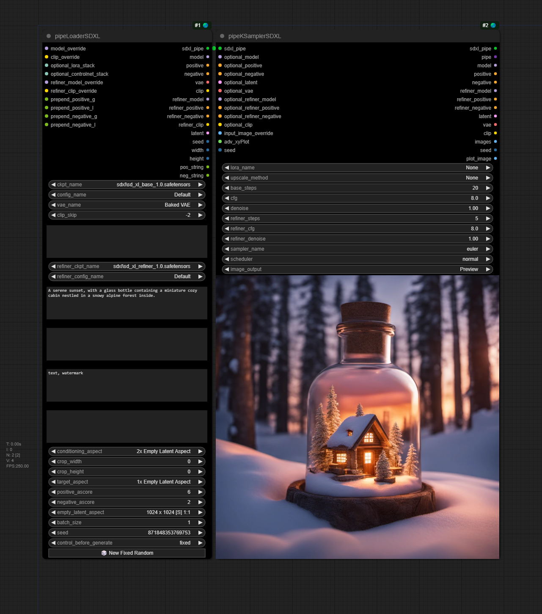
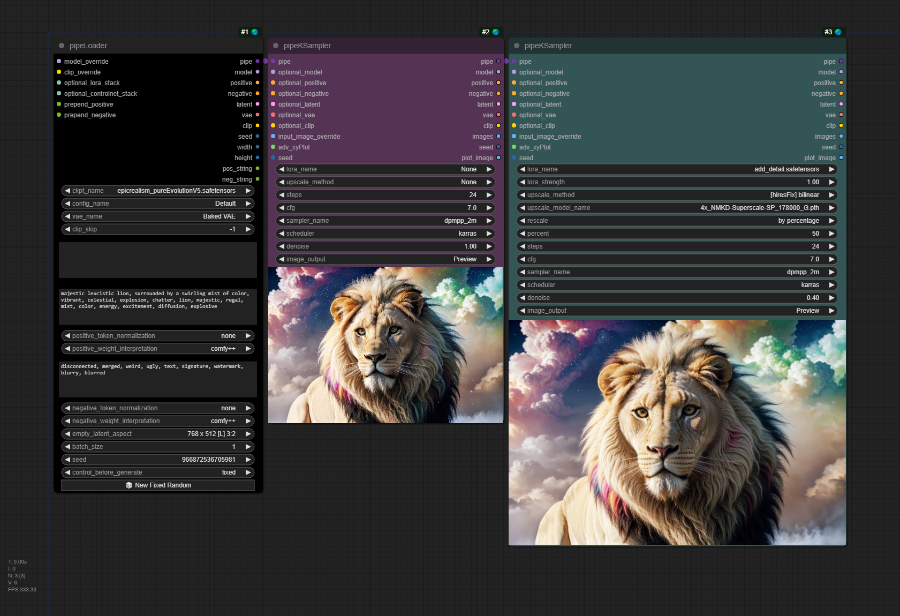
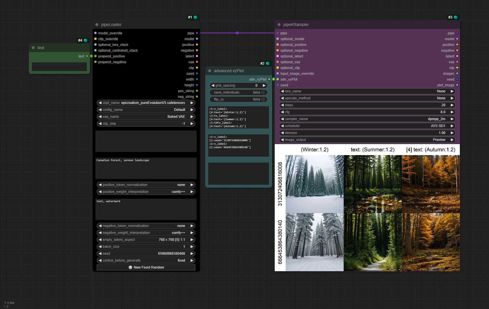
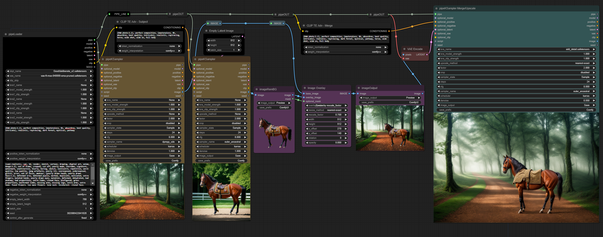

# tinyterraNodes

*A selection of custom nodes for [ComfyUI](https://github.com/comfyanonymous/ComfyUI).*

**Enjoy my nodes and would like to [help keep me awake](https://buymeacoffee.com/tinyterra)?**


 


## Installation
Navigate to the **_ComfyUI/custom_nodes_** directory with cmd, and run:

`git clone https://github.com/TinyTerra/ComfyUI_tinyterraNodes.git`

### Special Features
**Fullscreen Image Viewer**

*Enabled by default*

+ <details><summary>Adds 'Fullscreen 🌏' to the node right-click context menu</summary> Opens a Fullscreen image viewer - containing all images generated by the selected node during the current comfy session.
+ <details><summary>Adds 'Set Default Fullscreen Node 🌏' to the node right-click context menu</summary> Sets the currently selected node as the default Fullscreen node
+ <details><summary>Adds 'Clear Default Fullscreen Node 🌏' to the node right-click context menu</summary> Clears the assigned default Fullscreen node
<break>

+ Slideshow Mode 
    + Toggled On - Automatically jumps to New images as they are generated (Black Background) - the UI will auto hide after a set time.
    + Toggled Off - Holds to the current user selected image (Light Background)
+ Fullscreen Overlay
    + Toggles display of a navigable preview of all of the selected nodes images
    + Toggles display of the default comfy menu
  
+ *Shortcuts*
  + 'shift + F11' => _Open ttN-Fullscreen using selected node OR default fullscreen node_
  + 'shift + down arrow' (Node Selected) => _Set selected node as default fullscreen node_
  + 'shift + down arrow' (No Node Selected) => _removes default fullscreen node to None_

+ *Shortcuts in Fullscreen*
  + 'shift + F11' => _Close ttN-Fullscreen_
  + 'up arrow' => _Toggle Fullscreen Overlay_
  + 'down arrow' => _Toggle Slideshow Mode_
  + 'left arrow' => _Select Image to the left_
  + 'shift + left arrow' => _Select Image 5 to the left_
  + 'ctrl + left arrow' => _Select the first Image_
  + 'right arrow' => _Select Image to the right_
  + 'shift + right arrow' => _Select Image 5 to the right_
  + 'ctrl + right arrow' => _Select last Image_
  + 'mouse scroll' =>  _Zoom the current image in and out_
  + 'ctrl + mouse scroll' => _Select image to Left/Right_
  + 'left click + drag' => _Update the current image's position_
  + 'double click' => _Reset position of current image_
  + 'esc' => _Close Fullscreen Mode_
  + Show UI with mouse hover in Slideshow mode

**Advanced XY(Z)Plot**
+ pipeKSampler/SDXL input to generate xyz plots using any previous input nodes.
    + _(Any values not set by xyPlot will be taken from the corresponding nodes)_

+ Advanced xyPlot can take multiple variables for each axis somewhat programmatically.

+ Any image input - Use the 'advPlot images' node to create an xyplot from any image input.

Syntax:
```
<axis number1:label1>
[node_ID:widget_Name='value']

<axis number2:label2>
[node_ID:widget_Name='value2']
[node_ID:widget2_Name='value']
[node_ID2:widget_Name='value']
```
For Example:
```
<1:v_label>
[2:ckpt_name='model.safetensors']

<2:custom label>
[2:ckpt_name='checkpoint.xyz']
[2:vae_name='someVae.xyz']
[4:text='Summer sunset']
```
+  labels:
    + Any custom string for a custom axis label
    + v_label - for a concatenation of the values being set. In the example above if both were set to v_label:
        + model.safetensors
        + checkpoint.xyz, someVae.xyz, Summer sunset
    + tv_label - for the option title and value concatenated. In the example above if both were set to tv_label:
        + ckpt_name: model.safetensors
        + ckpt_name: checkpoint.xyz, vae_name: someVae.xyz, text: Summer sunset
    + itv_label - for the node ID, option title and value concatenated. In the example above if both were set to itv_label:
        + [2] ckpt_name: model.safetensors
        + [2] ckpt_name: checkpoint.xyz, [2] vae_name: someVae.xyz, [4] text: Summer sunset
+ Node ID's:
    + Suggested to use 'Badge: ID + nickname' in [ComfyUI Manager](https://github.com/ltdrdata/ComfyUI-Manager) settings to be able to view node IDs.
+ Autocomplete:
    + ttN Autocomplete will activate when the advanced xyPlot node is connected to a sampler, and will show all the nodes and options available, as well as an 'add axis' option to auto add the code for a new axis number and label.
+ Search and Replace:
    + if you include %search;replace% as the value it will use the current nodes value and do a search and replace using these values.
    + you can include more than one to replace different strings
+ Append to original value
    + if you include .append to the widget name it will append the xyPlot value to the original instead of overwriting it.
    + For example: [1:loras.append='\<lora:add_detail.safetensors:0.8>']
+ Z-Axis support for multi plotting
    + Creates extra xyPlots with the z-axis value changes as a base
+ Node based plotting to avoid requiring manually writing syntax
    + advPlot range for easily created int/float ranges
    + advPlot string for delimited string 'ranges'

**Auto Complete**

*Enabled by default*
+ displays a popup to autocomplete embedding filenames in text widgets - to use, start typing **embedding** and select an option from the list.
+ displays a popup to autocomplete noodlesoup categories - to use, start typing **__** and select an option from the list.
+ displays a popup in ttN 'loras' input to autocomplete loras from a list.
+ Option to disable ([ttNodes] enable_embed_autocomplete = True | False)

**Dynamic Widgets**

*Enabled by default*

+ Automatically hides and shows widgets depending on their relevancy
+ Option to disable ([ttNodes] enable_dynamic_widgets = True | False)

**ttNinterface**

*Enabled by default*

+ <details><summary>Adds 'Node Dimensions 🌏' to the node right-click context menu</summary> Allows setting specific node Width and Height values as long as they are above the minimum size for the given node.
+ <details><summary>Adds 'Default BG Color 🌏' to the node right-click context menu</summary> Allows setting specific default background color for every node added.

+ <details><summary>Adds support for 'ctrl + arrow key' Node movement</summary> This aligns the node(s) to the set ComfyUI grid spacing size and move the node in the direction of the arrow key by the grid spacing value. Holding shift in addition will move the node by the grid spacing size * 10.
+ <details><summary>Adds 'Reload Node 🌏' to the node right-click context menu</summary> Creates a new instance of the node with the same position, size, color and title . It attempts to retain set widget values which is useful for replacing nodes when a node/widget update occurs </details>
+ <details><summary>Adds 'Slot Type Color 🌏' to the Link right-click context menu</summary> Opens a color picker dialog menu to update the color of the selected link type. </details>
+ <details><summary>Adds 'Link Border 🌏' to the Link right-click context menu</summary> Toggles link line border. </details>
+ <details><summary>Adds 'Link Shadow 🌏' to the Link right-click context menu</summary> Toggles link line shadow. </details>
+ <details><summary>Adds 'Link Style 🌏' to the Link right-click context menu</summary> Sets the default link line type. </details>


**Save image prefix parsing**

+ Add date/time info to filenames or output folder by using: %date:yyyy-MM-dd-hh-mm-ss%
+ Parse any upstream setting into filenames or output folder by using %[widget_name]% (for the current node) <br>
or %input_name>input_name>widget_name% (for inputting nodes) <br>
  <details><summary>Example:
  </summary>

  
  </details>

**Node Versioning**

+ All tinyterraNodes now have a version property so that if any future changes are made to widgets that would break workflows the nodes will be highlighted on load
+ Will only work with workflows created/saved after the v1.0.0 release

**AutoUpdate**

*Disabled by default*

+ Option to auto-update the node pack ([ttNodes] auto_update = False | True)

<br>
<details open>
	<summary>$\Large\color{white}{Nodes}$</summary>

## ttN/base
<details>
  <summary>tinyLoader</summary>
   </details>

<details>
  <summary>tinyConditioning</summary>  
   </details>

<details>
    <summary>tinyKSampler</summary>
    </details>

## ttN/pipe

<details>
  <summary>pipeLoader v2</summary>
  
(Includes [ADV_CLIP_emb](https://github.com/BlenderNeko/ComfyUI_ADV_CLIP_emb))


   </details>

<details>
  <summary>pipeKSampler v2</summary>


Embedded with Advanced CLIP Text Encode with an additional pipe output


Old node layout:


With pipeLoader and pipeKSampler:


  </details>

<details>
  <summary>pipeKSamplerAdvanced v2</summary>

Embedded with Advanced CLIP Text Encode with an additional pipe output


  </details>

  <details>
  <summary>pipeLoaderSDXL v2</summary>

SDXL Loader and Advanced CLIP Text Encode with an additional pipe output


   </details>

<details>
  <summary>pipeKSamplerSDXL v2</summary>

SDXL Sampler (base and refiner in one) and Advanced CLIP Text Encode with an additional pipe output


Old node layout:


With pipeLoaderSDXL and pipeKSamplerSDXL:


  </details>
  


<details>
  <summary>pipeEDIT</summary>

Update/Overwrite any of the 8 original inputs in a Pipe line with new information.
+ _**Inputs -** pipe, model, conditioning, conditioning, samples, vae, clip, image, seed_
+ _**Outputs -** pipe_
   </details>

<details>
  <summary>pipe > basic_pipe</summary>

Convert ttN pipe line to basic pipe (to be compatible with [ImpactPack](https://github.com/ltdrdata/ComfyUI-Impact-Pack)), WITH original pipe throughput
+ _**Inputs -** pipe[model, conditioning, conditioning, samples, vae, clip, image, seed]_
+ _**Outputs -** basic_pipe[model, clip, vae, conditioning, conditioning], pipe_
   </details>

<details>
  <summary>pipe > Detailer Pipe</summary>
  
Convert ttN pipe line to detailer pipe (to be compatible with [ImpactPack](https://github.com/ltdrdata/ComfyUI-Impact-Pack)), WITH original pipe throughput
+ _**Inputs -** pipe[model, conditioning, conditioning, samples, vae, clip, image, seed], bbox_detector, sam_model_opt_
+ _**Outputs -** detailer_pipe[model, vae, conditioning, conditioning, bbox_detector, sam_model_opt], pipe_
   </details>

## ttN/xyPlot
<details>
  <summary>adv xyPlot</summary>
  
pipeKSampler input to generate xy plots using sampler and loader values. (Any values not set by xyPlot will be taken from the corresponding nodes)


   </details>

<details>
  <summary>advPlot images</summary>
  
Node to generate xyz plots from any image inputs. 
   </details>

<details>
  <summary>advPlot range</summary>
  
adv_xyPlot input to generate plot syntax across a range of values. 
   </details>

<details>
  <summary>advPlot string</summary>
  
adv_xyPlot input to generate plot syntax for strings via a delimiter. 
   </details>

<details>
  <summary>advPlot combo</summary>
  
adv_xyPlot input to generate plot syntax for combos with various modes. 
   </details>

## ttN/image
  
<details>
  <summary>imageOutput</summary>
  
Preview or Save an image with one node, with image throughput.
+ _**Inputs -** image, image output[Hide, Preview, Save, Hide/Save], output path, save prefix, number padding[None, 2-9], file type[PNG, JPG, JPEG, BMP, TIFF, TIF] overwrite existing[True, False], embed workflow[True, False]_
+ _**Outputs -** image_
  
</details>
  
<details>
  <summary>imageRemBG</summary>
  
(Using [RemBG](https://github.com/danielgatis/rembg))

Background Removal node with optional image preview & save.
+ _**Inputs -** image, image output[Disabled, Preview, Save], save prefix_
+ _**Outputs -** image, mask_

Example of a photobashing workflow using pipeNodes, imageRemBG, imageOutput and nodes from [ADV_CLIP_emb](https://github.com/BlenderNeko/ComfyUI_ADV_CLIP_emb) and [ImpactPack](https://github.com/ltdrdata/ComfyUI-Impact-Pack/tree/Main):


 </details>
  
<details>
  <summary>hiresFix</summary>

Upscale image by model, optional rescale of result image.
+ _**Inputs -** image, vae, upscale_model, rescale_after_model[true, false], rescale[by_percentage, to Width/Height], rescale method[nearest-exact, bilinear, area], factor, width, height, crop, image_output[Hide, Preview, Save], save prefix, output_latent[true, false]_
+ _**Outputs -** image, latent_
   </details>

## ttN/text
<details>
  <summary>text</summary>

Basic TextBox Loader.
+ _**Outputs -** text (STRING)_
   </details>

<details>
  <summary>textDebug</summary>

Text input, to display text inside the node, with optional print to console.
+ _**inputs -** text, print_to_console_
+ _**Outputs -** text (STRING)_
   </details>
  
<details>
  <summary>textConcat</summary>

3 TextBOX inputs with a single concatenated output.
+ _**inputs -** text1, text2, text3 (STRING's), delimiter_
+ _**Outputs -** text (STRING)_
   </details>

<details>
  <summary>7x TXT Loader Concat</summary>

7 TextBOX inputs concatenated with spaces into a single output, AND separate text outputs.
+ _**inputs -** text1, text2, text3, text4, text5, text6, text7 (STRING's), delimiter_
+ _**Outputs -** text1, text2, text3, text4, text5, text6, text7, concat (STRING's)_
   </details>

<details>
  <summary>3x TXT Loader MultiConcat</summary>

3 TextBOX inputs with separate text outputs AND multiple concatenation variations (concatenated with spaces).
+ _**inputs -** text1, text2, text3 (STRING's), delimiter_
+ _**Outputs -** text1, text2, text3, 1 & 2, 1 & 3, 2 & 3, concat (STRING's)_
   </details>

## ttN/util
<details>
  <summary>seed</summary>

Basic Seed Loader.
+ _**Outputs -** seed (INT)_
   </details>

<details>
  <summary>float</summary>

float loader and converter
+ _**inputs -** float (FLOAT)_
+ _**Outputs -** float, int, text (FLOAT, INT, STRING)_
   </details>

<details>
  <summary>int</summary>
  
int loader and converter
+ _**inputs -** int (INT)_
+ _**Outputs -** int, float, text (INT, FLOAT, STRING)_
   </details>
  
 </details>

## ttN/legacy

<details>
  <summary>pipeLoader v1</summary>
  
(Modified from [Efficiency Nodes](https://github.com/LucianoCirino/efficiency-nodes-comfyui) and [ADV_CLIP_emb](https://github.com/BlenderNeko/ComfyUI_ADV_CLIP_emb))

Combination of Efficiency Loader and Advanced CLIP Text Encode with an additional pipe output
+ _**Inputs -** model, vae, clip skip, (lora1, modelstrength clipstrength), (Lora2, modelstrength clipstrength), (Lora3, modelstrength clipstrength), (positive prompt, token normalization, weight interpretation), (negative prompt, token normalization, weight interpretation), (latent width, height), batch size, seed_
+ _**Outputs -** pipe, model, conditioning, conditioning, samples, vae, clip, seed_
   </details>

<details>
  <summary>pipeKSampler v1</summary>
  
(Modified from [Efficiency Nodes](https://github.com/LucianoCirino/efficiency-nodes-comfyui) and [QOLS_Omar92](https://github.com/omar92/ComfyUI-QualityOfLifeSuit_Omar92))

Combination of Efficiency Loader and Advanced CLIP Text Encode with an additional pipe output
+ _**Inputs -** pipe, (optional pipe overrides), xyplot, (Lora, model strength, clip strength), (upscale method, factor, crop), sampler state, steps, cfg, sampler name, scheduler, denoise, (image output [None, Preview, Save]), Save_Prefix, seed_
+ _**Outputs -** pipe, model, conditioning, conditioning, samples, vae, clip, image, seed_

Old node layout:


With pipeLoader and pipeKSampler:


  </details>

<details>
  <summary>pipeKSamplerAdvanced v1</summary>

Combination of Efficiency Loader and Advanced CLIP Text Encode with an additional pipe output
+ _**Inputs -** pipe, (optional pipe overrides), xyplot, (Lora, model strength, clip strength), (upscale method, factor, crop), sampler state, steps, cfg, sampler name, scheduler, starts_at_step, return_with_leftover_noise, (image output [None, Preview, Save]), Save_Prefix_
+ _**Outputs -** pipe, model, conditioning, conditioning, samples, vae, clip, image, seed_

  </details>

  <details>
  <summary>pipeLoaderSDXL v1</summary>

SDXL Loader and Advanced CLIP Text Encode with an additional pipe output
+ _**Inputs -** model, vae, clip skip, (lora1, modelstrength clipstrength), (Lora2, modelstrength clipstrength), model, vae, clip skip, (lora1, modelstrength clipstrength), (Lora2, modelstrength clipstrength), (positive prompt, token normalization, weight interpretation), (negative prompt, token normalization, weight interpretation), (latent width, height), batch size, seed_
+ _**Outputs -** sdxlpipe, model, conditioning, conditioning, vae, model, conditioning, conditioning, vae, samples, clip, seed_
   </details>

<details>
  <summary>pipeKSamplerSDXL v1</summary>

SDXL Sampler (base and refiner in one) and Advanced CLIP Text Encode with an additional pipe output
+ _**Inputs -** sdxlpipe, (optional pipe overrides), (upscale method, factor, crop), sampler state, base_steps, refiner_steps cfg, sampler name, scheduler, (image output [None, Preview, Save]), Save_Prefix, seed_
+ _**Outputs -** pipe, model, conditioning, conditioning, vae, model, conditioning, conditioning, vae, samples, clip, image, seed_

Old node layout:


With pipeLoaderSDXL and pipeKSamplerSDXL:


  </details>
  
<details>
  <summary>pipeIN</summary>

Encode up to 8 frequently used inputs into a single Pipe line.
+ _**Inputs -** model, conditioning, conditioning, samples, vae, clip, image, seed_
+ _**Outputs -** pipe_
   </details>

<details>
  <summary>pipeOUT</summary>

Decode single Pipe line into the 8 original outputs, AND a Pipe throughput.
+ _**Inputs -** pipe_
+ _**Outputs -** model, conditioning, conditioning, samples, vae, clip, image, seed, pipe_
   </details>

<details>
  <summary>pipe > xyPlot</summary>
  
pipeKSampler input to generate xy plots using sampler and loader values. (Any values not set by xyPlot will be taken from the corresponding pipeKSampler or pipeLoader)
+ _**Inputs -** grid_spacing, latent_id, flip_xy, x_axis, x_values, y_axis, y_values_
+ _**Outputs -** xyPlot_
   </details>